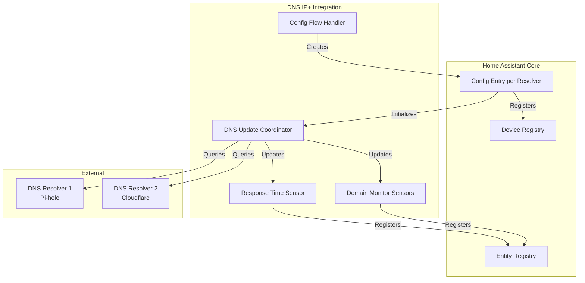
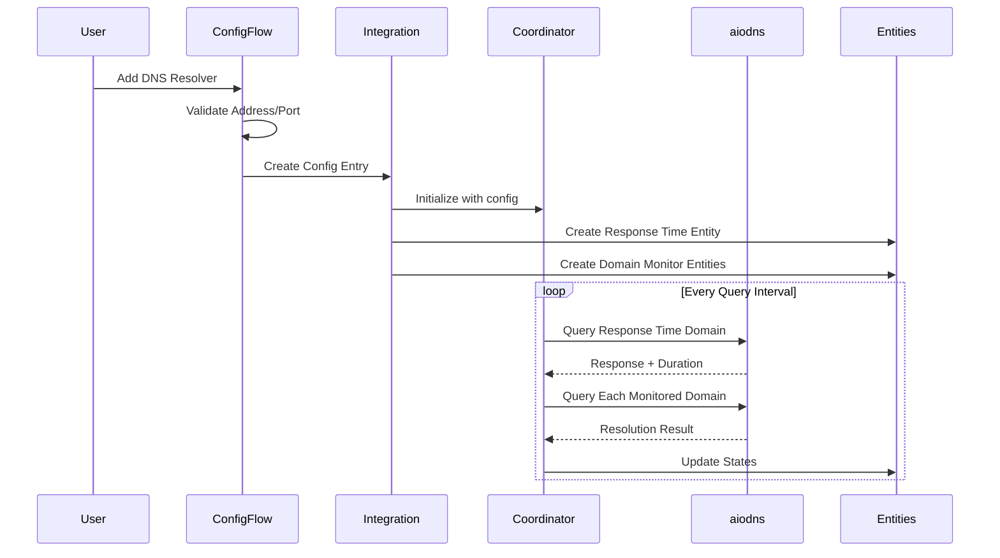
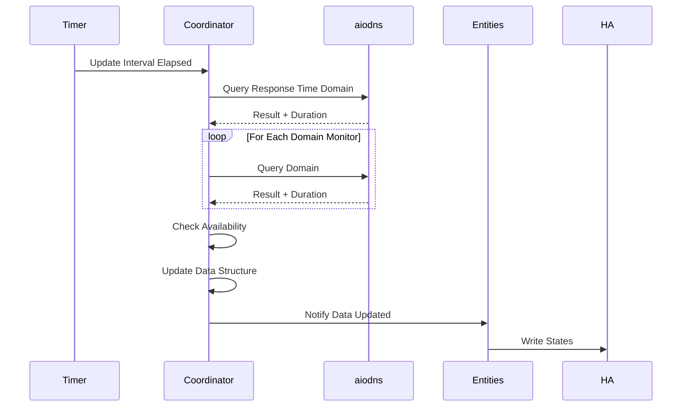

# Design Document: DNS Resolver Monitoring

## Overview

This design transforms the DNS IP+ Home Assistant integration from a single-instance IP address resolver into a comprehensive multi-device DNS resolver monitoring system. The primary architectural shift involves moving from a single config entry that creates multiple sensors to a multi-device architecture where each DNS resolver (e.g., Pi-hole instance) is represented as a separate Home Assistant device with its own config entry.

The system enables users to monitor multiple DNS resolvers simultaneously, tracking both response time performance and domain resolution availability. Each resolver device can monitor multiple domains with different record types, creating a flexible monitoring solution for home network DNS infrastructure.

### Key Design Goals

1. **Multi-Device Architecture**: Support multiple independent DNS resolver devices within a single integration installation
2. **Flexible Monitoring**: Allow per-resolver configuration of domains and record types to monitor
3. **Performance Tracking**: Measure and expose DNS query response times for performance monitoring
4. **Availability Detection**: Detect and report resolver unavailability through entity states
5. **Async Efficiency**: Leverage Home Assistant's async architecture with aiodns for non-blocking DNS queries
6. **User-Friendly Configuration**: Provide intuitive config flow UI for setup and reconfiguration

## Architecture

### High-Level Architecture



### Multi-Device Pattern

The integration uses Home Assistant's multi-device pattern where:

1. Each DNS resolver is a separate config entry
2. Each config entry creates one Home Assistant device
3. Each device has multiple entities (response time + domain monitors)
4. Users can add multiple resolvers through the config flow
5. Each resolver operates independently with its own update coordinator

This differs from the current single-device pattern where one config entry creates multiple sensors under one device.

### Component Interaction Flow



## Components and Interfaces

### 1. Config Flow Handler (`config_flow.py`)

The config flow manages the UI-based configuration for adding and modifying DNS resolver devices.

#### Responsibilities

- Validate resolver addresses (IP or hostname)
- Validate port numbers (1-65535)
- Validate domain names (DNS format)
- Validate query intervals (10-3600 seconds)
- Support adding multiple domain monitors per resolver
- Provide options flow for reconfiguration

#### Interface

```python
class DnsResolverMonitoringConfigFlow(ConfigFlow):
    """Handle config flow for DNS resolver monitoring."""
    
    async def async_step_user(
        self, user_input: dict[str, Any] | None = None
    ) -> ConfigFlowResult:
        """Handle initial resolver configuration step."""
        # Prompts for: device_name, resolver_address, resolver_port, query_interval
        
    async def async_step_domains(
        self, user_input: dict[str, Any] | None = None
    ) -> ConfigFlowResult:
        """Handle domain monitor configuration step."""
        # Allows adding multiple domain monitors
        # Each with: domain_name, record_type
        
    async def async_validate_resolver(
        self, address: str, port: int
    ) -> bool:
        """Validate resolver is reachable."""
        # Performs test DNS query to validate connectivity

class DnsResolverMonitoringOptionsFlow(OptionsFlowWithConfigEntry):
    """Handle options flow for reconfiguration."""
    
    async def async_step_init(
        self, user_input: dict[str, Any] | None = None
    ) -> ConfigFlowResult:
        """Handle options flow initialization."""
        # Allows modifying all configuration parameters
```

#### Validation Logic

- **Resolver Address**: Must be valid IPv4, IPv6, or hostname format
- **Resolver Port**: Integer between 1 and 65535
- **Domain Name**: Must match DNS name format (labels separated by dots)
- **Query Interval**: Integer between 10 and 3600 seconds
- **Record Type**: Must be one of supported DNS record types

#### Multi-Step Flow

1. **Step 1 - Resolver Configuration**: Collect device name, address, port, interval
2. **Step 2 - Domain Monitors**: Allow adding 0+ domain monitors with domain and record type
3. **Step 3 - Confirmation**: Display summary and create config entry

### 2. Data Update Coordinator (`coordinator.py`)

The coordinator manages DNS query scheduling and state updates for a single resolver device.

#### Responsibilities

- Schedule DNS queries at configured interval
- Execute async DNS queries using aiodns
- Track response times for performance monitoring
- Detect resolver availability (3 consecutive failures = unavailable)
- Update entity states with query results
- Handle DNS query timeouts and errors
- Log query failures with context

#### Interface

```python
class DnsResolverCoordinator(DataUpdateCoordinator):
    """Coordinator for DNS resolver monitoring."""
    
    def __init__(
        self,
        hass: HomeAssistant,
        resolver_address: str,
        resolver_port: int,
        domain_monitors: list[DomainMonitorConfig],
        query_interval: int,
    ):
        """Initialize coordinator with resolver configuration."""
        
    async def _async_update_data(self) -> DnsResolverData:
        """Fetch data from DNS resolver."""
        # Queries response time domain
        # Queries all configured domain monitors
        # Returns structured data with results
        
    async def _query_with_timeout(
        self, domain: str, record_type: str
    ) -> DnsQueryResult:
        """Execute DNS query with 10-second timeout."""
        
    def _check_availability(self) -> None:
        """Update availability status based on consecutive failures."""
```

#### Data Flow

1. Coordinator wakes up at query interval
2. Creates aiodns.DNSResolver instance with configured address/port
3. Queries response time domain (uses same domain as current implementation)
4. Queries each configured domain monitor
5. Measures response time for each query
6. Aggregates results into DnsResolverData structure
7. Notifies entities of new data
8. Tracks consecutive failures for availability detection

#### Availability Logic

- Maintains counter of consecutive response time query failures
- When response time query fails for 3 consecutive intervals, marks resolver as unavailable
- When response time query succeeds, resets counter and marks resolver as available
- Resolver availability is determined solely by response time query (to known-good domain)
- Domain monitor query failures only affect individual domain entity availability
- Unavailable resolver status propagates to all domain monitor entities

### 3. Response Time Sensor Entity (`sensor.py`)

A sensor entity that displays DNS query response time in milliseconds.

#### Responsibilities

- Display current response time as state
- Use duration device class
- Use milliseconds as unit
- Mark unavailable when resolver is unavailable
- Update from coordinator data

#### Interface

```python
class DnsResponseTimeSensor(CoordinatorEntity, SensorEntity):
    """Sensor for DNS resolver response time."""
    
    _attr_device_class = SensorDeviceClass.DURATION
    _attr_native_unit_of_measurement = UnitOfTime.MILLISECONDS
    _attr_state_class = SensorStateClass.MEASUREMENT
    
    @property
    def native_value(self) -> float | None:
        """Return response time in milliseconds."""
        
    @property
    def available(self) -> bool:
        """Return availability based on coordinator status."""
```

#### Entity Properties

- **Name**: `{device_name} Response Time`
- **Unique ID**: `{config_entry_id}_response_time`
- **Device Class**: Duration
- **Unit**: Milliseconds
- **State Class**: Measurement (enables statistics)

### 4. Domain Monitor Sensor Entity (`sensor.py`)

A sensor entity that displays the resolved value for a monitored domain.

#### Responsibilities

- Display resolved DNS value as state
- Include record type as attribute
- Include query response time as attribute
- Mark unavailable when query fails or resolver unavailable
- Update from coordinator data

#### Interface

```python
class DomainMonitorSensor(CoordinatorEntity, SensorEntity):
    """Sensor for monitoring specific domain resolution."""
    
    @property
    def native_value(self) -> str | None:
        """Return resolved DNS value."""
        
    @property
    def extra_state_attributes(self) -> dict[str, Any]:
        """Return additional attributes."""
        # Returns: record_type, response_time_ms, query_timestamp
        
    @property
    def available(self) -> bool:
        """Return availability based on query success."""
```

#### Entity Properties

- **Name**: `{device_name} {domain_name} {record_type}`
- **Unique ID**: `{config_entry_id}_domain_{sanitized_domain}_{record_type}`
- **State**: Resolved value (IP address, hostname, etc.)
- **Attributes**: 
  - `record_type`: DNS record type queried
  - `response_time_ms`: Query response time
  - `query_timestamp`: Last successful query time

### 5. Device Registration

Each resolver config entry creates a Home Assistant device.

#### Device Properties

- **Name**: User-configured device name
- **Identifiers**: `(DOMAIN, config_entry_id)`
- **Manufacturer**: "DNS"
- **Model**: f"Resolver Monitor (aiodns {version})"
- **Entry Type**: DeviceEntryType.SERVICE

All entities (response time + domain monitors) are associated with this device.

## Data Models

### Configuration Data Structures

```python
@dataclass
class DomainMonitorConfig:
    """Configuration for a single domain monitor."""
    domain: str
    record_type: str  # A, AAAA, PTR, MX, TXT, CNAME, NS, SOA, SRV

@dataclass
class ResolverConfig:
    """Configuration for a DNS resolver device."""
    device_name: str
    resolver_address: str
    resolver_port: int
    query_interval: int  # seconds
    domain_monitors: list[DomainMonitorConfig]
```

### Config Entry Storage

Config entries store data in two sections:

#### Data Section (Immutable)
```python
{
    "device_name": str,
    "resolver_address": str,
    "resolver_port": int,
}
```

#### Options Section (Mutable via Options Flow)
```python
{
    "query_interval": int,
    "domain_monitors": [
        {
            "domain": str,
            "record_type": str,
        },
        ...
    ]
}
```

### Runtime Data Structures

```python
@dataclass
class DnsQueryResult:
    """Result of a single DNS query."""
    success: bool
    value: str | None  # Resolved value
    response_time_ms: float | None
    error: str | None
    timestamp: datetime

@dataclass
class DnsResolverData:
    """Aggregated data from coordinator update."""
    response_time_result: DnsQueryResult
    domain_results: dict[str, DnsQueryResult]  # Key: f"{domain}_{record_type}"
    resolver_available: bool
    consecutive_failures: int
```

### Constants

```python
# const.py additions
CONF_DEVICE_NAME = "device_name"
CONF_RESOLVER_ADDRESS = "resolver_address"
CONF_RESOLVER_PORT = "resolver_port"
CONF_QUERY_INTERVAL = "query_interval"
CONF_DOMAIN_MONITORS = "domain_monitors"
CONF_DOMAIN = "domain"
CONF_RECORD_TYPE = "record_type"

DEFAULT_QUERY_INTERVAL = 60  # seconds
DEFAULT_RESOLVER_PORT = 53
MIN_QUERY_INTERVAL = 10
MAX_QUERY_INTERVAL = 3600

# Supported DNS record types
SUPPORTED_RECORD_TYPES = [
    "A", "AAAA", "PTR", "MX", "TXT", 
    "CNAME", "NS", "SOA", "SRV"
]

# Availability detection
CONSECUTIVE_FAILURES_THRESHOLD = 3
DNS_QUERY_TIMEOUT = 10  # seconds
```

## DNS Query Implementation

### aiodns Integration

The integration uses aiodns 3.6.1 for async DNS queries.

#### Query Pattern

```python
async def query_dns(
    resolver_address: str,
    resolver_port: int,
    domain: str,
    record_type: str,
) -> DnsQueryResult:
    """Execute DNS query with timeout and error handling."""
    
    resolver = aiodns.DNSResolver(
        nameservers=[resolver_address],
        udp_port=resolver_port,
        tcp_port=resolver_port,
    )
    
    start_time = time.perf_counter()
    
    try:
        async with asyncio.timeout(DNS_QUERY_TIMEOUT):
            response = await resolver.query(domain, record_type)
        
        response_time = (time.perf_counter() - start_time) * 1000
        
        # Extract value based on record type
        value = extract_dns_value(response, record_type)
        
        return DnsQueryResult(
            success=True,
            value=value,
            response_time_ms=round(response_time, 2),
            error=None,
            timestamp=datetime.now(),
        )
        
    except TimeoutError:
        _LOGGER.debug(
            "DNS query timeout for %s (%s) via %s",
            domain, record_type, resolver_address
        )
        return DnsQueryResult(
            success=False,
            value=None,
            response_time_ms=None,
            error="timeout",
            timestamp=datetime.now(),
        )
        
    except DNSError as err:
        _LOGGER.warning(
            "DNS query failed for %s (%s) via %s: %s",
            domain, record_type, resolver_address, err
        )
        return DnsQueryResult(
            success=False,
            value=None,
            response_time_ms=None,
            error=str(err),
            timestamp=datetime.now(),
        )
    
    finally:
        await resolver.close()
```

#### Record Type Handling

Different DNS record types return different response structures:

- **A/AAAA**: Returns list of IP addresses (use first or join)
- **PTR**: Returns hostname
- **MX**: Returns list of mail servers with priority
- **TXT**: Returns list of text records
- **CNAME**: Returns canonical name
- **NS**: Returns list of nameservers
- **SOA**: Returns start of authority record
- **SRV**: Returns service records with priority/weight/port

The `extract_dns_value` function handles these variations:

```python
def extract_dns_value(response: Any, record_type: str) -> str:
    """Extract displayable value from DNS response."""
    
    if record_type in ("A", "AAAA"):
        # Return first IP or comma-separated list
        hosts = [r.host for r in response]
        return hosts[0] if len(hosts) == 1 else ", ".join(hosts)
    
    elif record_type == "MX":
        # Return mail servers with priority
        mx_records = [(r.priority, r.host) for r in response]
        return ", ".join(f"{host} ({priority})" for priority, host in sorted(mx_records))
    
    elif record_type == "TXT":
        # Return text records
        return ", ".join(r.text for r in response)
    
    elif record_type in ("CNAME", "PTR", "NS"):
        # Return hostname(s)
        if hasattr(response[0], 'host'):
            return response[0].host
        return str(response[0])
    
    elif record_type == "SOA":
        # Return primary nameserver
        return response[0].nsname
    
    elif record_type == "SRV":
        # Return service records
        srv_records = [(r.priority, r.weight, r.port, r.host) for r in response]
        return ", ".join(
            f"{host}:{port} (p:{priority} w:{weight})" 
            for priority, weight, port, host in sorted(srv_records)
        )
    
    return str(response)
```

### Response Time Domain

For response time monitoring, the coordinator queries a known-good domain:

- Default: `myip.opendns.com` (A record)
- This provides a baseline response time measurement
- Users cannot configure this domain (it's internal to response time monitoring)
- If this query fails, it counts toward availability detection

## Entity Lifecycle and State Management

### Initialization Flow

1. **Config Entry Created**: User completes config flow
2. **Integration Setup**: `async_setup_entry` called in `__init__.py`
3. **Coordinator Created**: Initialize coordinator with config
4. **Device Registered**: Register device in device registry
5. **Entities Created**: Create response time + domain monitor entities
6. **Initial Update**: Coordinator performs first DNS queries
7. **Entities Added**: Entities added to Home Assistant with initial states

### Update Cycle



### State Transitions

#### Response Time Entity States

- **Available with Value**: Resolver responding, displays response time in ms
- **Unavailable**: Resolver not responding (3 consecutive failures)

#### Domain Monitor Entity States

- **Available with Value**: Domain query succeeded, displays resolved value
- **Unavailable**: Domain query failed OR resolver unavailable

### Reconfiguration Handling

When user modifies configuration via options flow:

1. **Options Updated**: New options saved to config entry
2. **Reload Triggered**: Config entry reload initiated
3. **Coordinator Recreated**: New coordinator with updated config
4. **Entities Recreated**: Entities recreated with new domain monitors
5. **Old Entities Removed**: Entities for removed domains are cleaned up
6. **New Entities Added**: Entities for new domains are added

Home Assistant's entity registry handles entity ID persistence and cleanup.

### Unload Flow

When config entry is removed:

1. **Unload Initiated**: User removes resolver device
2. **Coordinator Stopped**: Stop update timer
3. **Entities Removed**: All entities unregistered
4. **Device Removed**: Device removed from registry
5. **Config Entry Deleted**: Config entry removed from storage

## Error Handling

### DNS Query Errors

#### Timeout Errors
- **Cause**: Query exceeds 10-second timeout
- **Handling**: Log at debug level, mark query as failed
- **User Impact**: Entity becomes unavailable
- **Recovery**: Next successful query restores availability

#### DNS Resolution Errors
- **Cause**: Domain doesn't exist, NXDOMAIN, SERVFAIL, etc.
- **Handling**: Log at warning level with error details
- **User Impact**: Entity becomes unavailable
- **Recovery**: Next successful query restores availability

#### Network Errors
- **Cause**: Resolver unreachable, network down
- **Handling**: Caught as DNSError, logged with context
- **User Impact**: Counts toward availability detection
- **Recovery**: When network restored, queries resume

### Configuration Errors

#### Invalid Resolver Address
- **Detection**: Config flow validation
- **Handling**: Display error message, prevent entry creation
- **User Action**: Correct address format

#### Invalid Port Number
- **Detection**: Config flow validation (voluptuous schema)
- **Handling**: Display error message
- **User Action**: Enter port between 1-65535

#### Invalid Domain Name
- **Detection**: Config flow validation (DNS name format)
- **Handling**: Display error message
- **User Action**: Correct domain format

#### Invalid Query Interval
- **Detection**: Config flow validation
- **Handling**: Display error message
- **User Action**: Enter interval between 10-3600 seconds

### Availability Detection

The coordinator implements a consecutive failure counter based on the response time query:

```python
class DnsResolverCoordinator(DataUpdateCoordinator):
    def __init__(self, ...):
        self._consecutive_failures = 0
        self._available = True
    
    async def _async_update_data(self) -> DnsResolverData:
        # Perform response time query
        response_time_result = await self._query_with_timeout(
            RESPONSE_TIME_DOMAIN, "A"
        )
        
        # Perform domain monitor queries
        domain_results = {}
        for monitor in self.domain_monitors:
            result = await self._query_with_timeout(
                monitor.domain, monitor.record_type
            )
            domain_results[f"{monitor.domain}_{monitor.record_type}"] = result
        
        # Update availability based ONLY on response time query
        if response_time_result.success:
            self._consecutive_failures = 0
            if not self._available:
                _LOGGER.info(
                    "DNS resolver %s is now available",
                    self.resolver_address
                )
            self._available = True
        else:
            self._consecutive_failures += 1
            if self._consecutive_failures >= CONSECUTIVE_FAILURES_THRESHOLD:
                if self._available:
                    _LOGGER.warning(
                        "DNS resolver %s is unavailable after %d consecutive failures",
                        self.resolver_address,
                        self._consecutive_failures
                    )
                self._available = False
        
        return DnsResolverData(
            response_time_result=response_time_result,
            domain_results=domain_results,
            resolver_available=self._available,
            consecutive_failures=self._consecutive_failures,
        )
```

### Logging Strategy

All log messages include context for troubleshooting:

```python
# Query failures
_LOGGER.warning(
    "DNS query failed for %s (%s) via %s:%d: %s",
    domain, record_type, resolver_address, resolver_port, error
)

# Availability changes
_LOGGER.warning(
    "DNS resolver %s (%s:%d) is unavailable after %d consecutive failures",
    device_name, resolver_address, resolver_port, consecutive_failures
)

_LOGGER.info(
    "DNS resolver %s (%s:%d) is now available",
    device_name, resolver_address, resolver_port
)

# Timeout events
_LOGGER.debug(
    "DNS query timeout for %s (%s) via %s:%d after %d seconds",
    domain, record_type, resolver_address, resolver_port, timeout
)
```

## Testing Strategy

The testing strategy employs both unit tests and property-based tests to ensure comprehensive coverage and correctness.

### Unit Testing Approach

Unit tests focus on specific examples, edge cases, and integration points:

- **Config Flow Validation**: Test specific valid/invalid inputs for addresses, ports, domains
- **DNS Query Error Handling**: Test specific error conditions (timeout, NXDOMAIN, SERVFAIL)
- **Entity State Transitions**: Test specific state changes (available → unavailable)
- **Availability Detection**: Test the 3-failure threshold with specific sequences
- **Record Type Extraction**: Test specific DNS response formats for each record type
- **Configuration Persistence**: Test specific config entry save/load scenarios

### Property-Based Testing Approach

Property-based tests verify universal properties across randomized inputs using a PBT library (e.g., Hypothesis for Python):

- **Minimum 100 iterations per property test** to ensure comprehensive input coverage
- Each test tagged with: `# Feature: dns-resolver-monitoring, Property {N}: {description}`
- Tests generate random valid inputs and verify properties hold universally

### Testing Library Selection

For Python/Home Assistant integration:
- **pytest**: Primary test framework
- **pytest-homeassistant-custom-component**: Home Assistant testing utilities
- **Hypothesis**: Property-based testing library for Python
- **pytest-asyncio**: Async test support

### Test Organization

```
tests/
├── __init__.py
├── conftest.py                    # Shared fixtures
├── test_config_flow.py            # Config flow unit tests
├── test_coordinator.py            # Coordinator unit tests
├── test_sensor.py                 # Entity unit tests
├── test_dns_queries.py            # DNS query unit tests
└── test_properties.py             # Property-based tests
```

### Mock Strategy

- Mock aiodns.DNSResolver for deterministic testing
- Mock Home Assistant core for config entry testing
- Use real DNS queries only in integration tests (optional)
- Mock time.perf_counter for response time testing


## Correctness Properties

*A property is a characteristic or behavior that should hold true across all valid executions of a system—essentially, a formal statement about what the system should do. Properties serve as the bridge between human-readable specifications and machine-verifiable correctness guarantees.*

### Property Reflection

Before defining properties, I analyzed the testable acceptance criteria to eliminate redundancy:

**Redundancy Analysis:**
- Properties 3.4 and 3.5 (device class and unit for response time entity) can be combined into a single property about entity configuration
- Properties 5.4 and 5.5 (record type and response time attributes for domain entity) can be combined into a single property about entity attributes
- Properties 9.2, 9.3, and 9.4 (entity and device naming) are all related to naming conventions and can be verified together
- Properties 8.5, 12.1, and 12.5 (logging with context) are all about the same logging requirement and can be combined

After reflection, the following properties provide unique validation value:

### Property 1: Config Flow Creates Device

*For any* valid resolver configuration (address, port, device name, query interval, domain monitors), when added through the config flow, the integration should create exactly one resolver device with a matching configuration.

**Validates: Requirements 1.2**

### Property 2: Device State Independence

*For any* set of multiple resolver devices, when one device's state is updated (queries executed, availability changed), all other devices should maintain their previous state unchanged.

**Validates: Requirements 1.3**

### Property 3: Device Removal Cleanup

*For any* resolver device with associated entities (response time sensor and domain monitor sensors), when the device is removed, all associated entities should be removed from the entity registry.

**Validates: Requirements 1.4**

### Property 4: Resolver Address Validation

*For any* string input, the config flow validation should accept it as a resolver address if and only if it is a valid IPv4 address, IPv6 address, or hostname format.

**Validates: Requirements 2.4**

### Property 5: Port Number Validation

*For any* integer input, the config flow validation should accept it as a resolver port if and only if it is between 1 and 65535 (inclusive).

**Validates: Requirements 2.5**

### Property 6: Response Time Entity Creation

*For any* resolver device configuration, the integration should create exactly one response time entity associated with that device.

**Validates: Requirements 3.1**

### Property 7: Response Time Entity Configuration

*For any* response time entity, it should have the duration device class and milliseconds as the unit of measurement.

**Validates: Requirements 3.4, 3.5**

### Property 8: Response Time State on Success

*For any* successful DNS query with measured duration, the response time entity should update its state to the query duration in milliseconds.

**Validates: Requirements 3.2**

### Property 9: Response Time State on Failure

*For any* failed DNS query, the response time entity should update its state to unavailable.

**Validates: Requirements 3.3**

### Property 10: Domain Name Validation

*For any* string input, the config flow validation should accept it as a domain name if and only if it matches valid DNS name format (labels separated by dots, valid characters).

**Validates: Requirements 4.5**

### Property 11: Domain Monitor Entity Creation

*For any* list of domain monitor configurations, the integration should create exactly one domain monitor entity for each configuration.

**Validates: Requirements 5.1**

### Property 12: Domain Monitor Entity Attributes

*For any* domain monitor entity, it should include both the DNS record type and query response time as state attributes.

**Validates: Requirements 5.4, 5.5**

### Property 13: Domain Monitor State on Success

*For any* successful DNS query for a monitored domain, the domain monitor entity should update its state to the resolved value.

**Validates: Requirements 5.2**

### Property 14: Domain Monitor State on Failure

*For any* failed DNS query for a monitored domain, the domain monitor entity should update its state to unavailable.

**Validates: Requirements 5.3**

### Property 15: Availability Recovery

*For any* resolver device in any availability state, when the response time DNS query succeeds, the device should be marked as available.

**Validates: Requirements 6.2**

### Property 16: Response Time Reflects Device Availability

*For any* resolver device, the response time entity's availability should match the device's availability status.

**Validates: Requirements 6.3**

### Property 17: Cascading Unavailability

*For any* resolver device with domain monitor entities, when the device becomes unavailable, all associated domain monitor entities should become unavailable.

**Validates: Requirements 6.4**

### Property 18: Query Interval Validation

*For any* integer input, the config flow validation should accept it as a query interval if and only if it is between 10 and 3600 seconds (inclusive).

**Validates: Requirements 7.2**

### Property 19: Exception Handling Robustness

*For any* DNS query that raises an exception (timeout, network error, DNS error), the integration should handle the exception without crashing and continue processing subsequent queries.

**Validates: Requirements 8.4**

### Property 20: Entity Device Assignment

*For any* entity (response time or domain monitor) created by a resolver device, the entity should be assigned to its parent resolver device in the device registry.

**Validates: Requirements 9.1**

### Property 21: Entity Naming Conventions

*For any* resolver device with device name D, the response time entity should be named "{D} Response Time", and for any domain monitor with domain name M and record type R, the entity should be named "{D} {M} {R}".

**Validates: Requirements 9.2, 9.3**

### Property 22: Entity ID Uniqueness

*For any* set of entities created by the integration, all entity IDs should be unique and follow the pattern "dnsipplus_{device_id}_{entity_type}_{identifier}".

**Validates: Requirements 9.5**

### Property 23: DNS Error Logging with Context

*For any* DNS query failure, the integration should log the error with the resolver address, domain name, and error reason included in the log message.

**Validates: Requirements 8.5, 12.1, 12.5**

